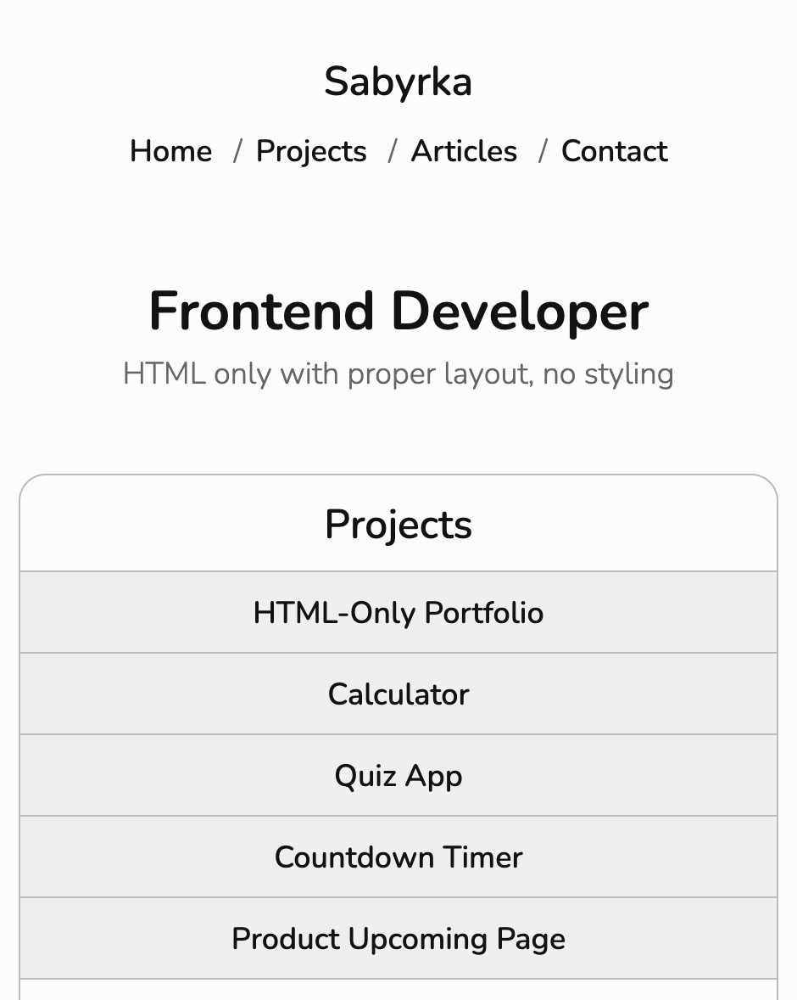

# Personal Portfolio

A responsive personal portfolio website built with semantic HTML and
CSS.

This project is part of the Frontend Developer roadmap from roadmap.sh
and continues the Basic HTML Website project where the layout was styled
using CSS.

## Preview

## Features

-   Semantic HTML structure
-   Responsive layout
-   Navigation between multiple pages
-   Styled contact form
-   Consistent color scheme and typography
-   SEO meta tags
-   Accessible markup

## Tech Stack

-   HTML5
-   CSS3
-   Flexbox
-   Media Queries

## Project Structure

    ├── index.html
    │
    ├── pages/
    │   ├── projects.html
    │   ├── articles.html
    │   └── contact.html
    │
    ├── styles/
    │   ├── base/
    │   ├── layout/
    │   ├── pages/
    │   └── main.css
    │
    ├── preview.png
    ├── favicon/
    │   └── favicon.svg
    │
    ├── README.md
    └── .gitignore

## Project Source

https://roadmap.sh/projects/portfolio-website

## Author

GitHub: https://github.com/sabyrkazan  
Telegram: https://t.me/sabyrkazan
